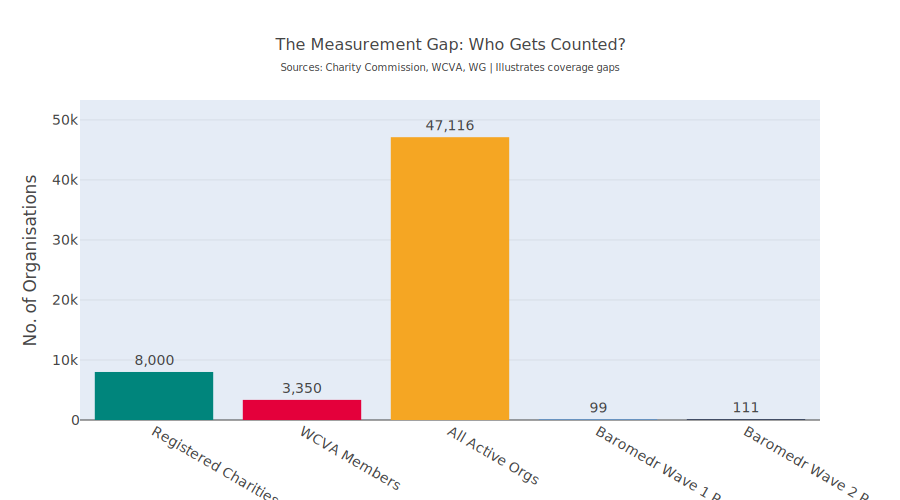
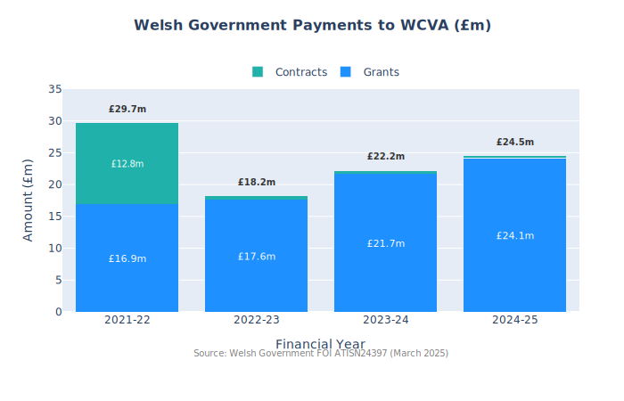
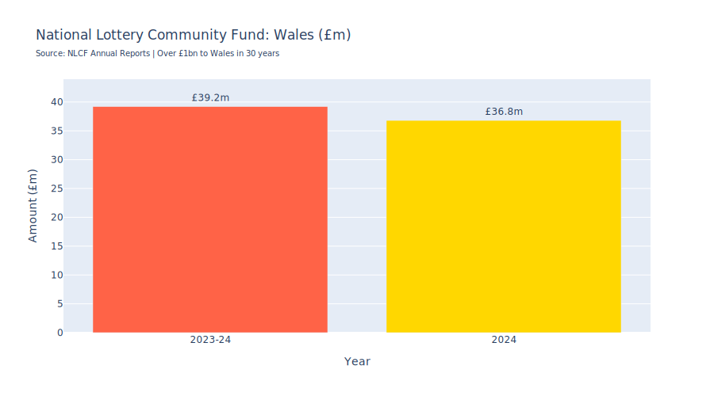
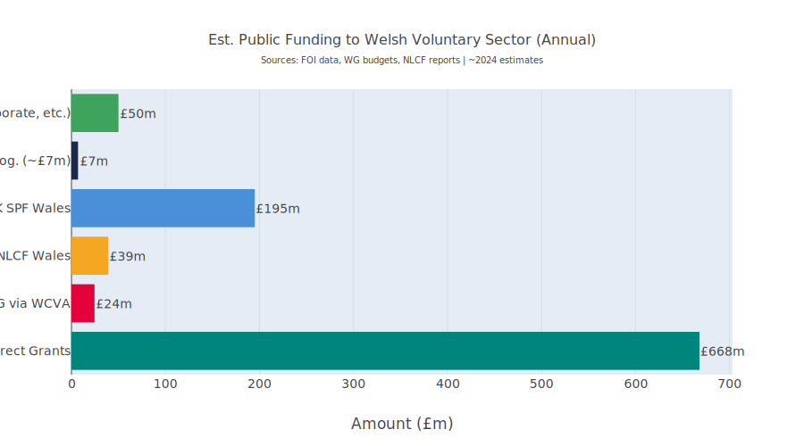
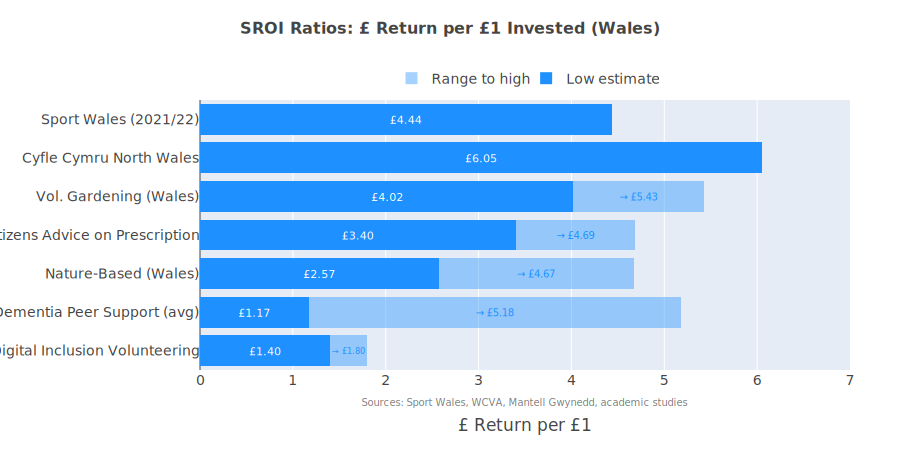
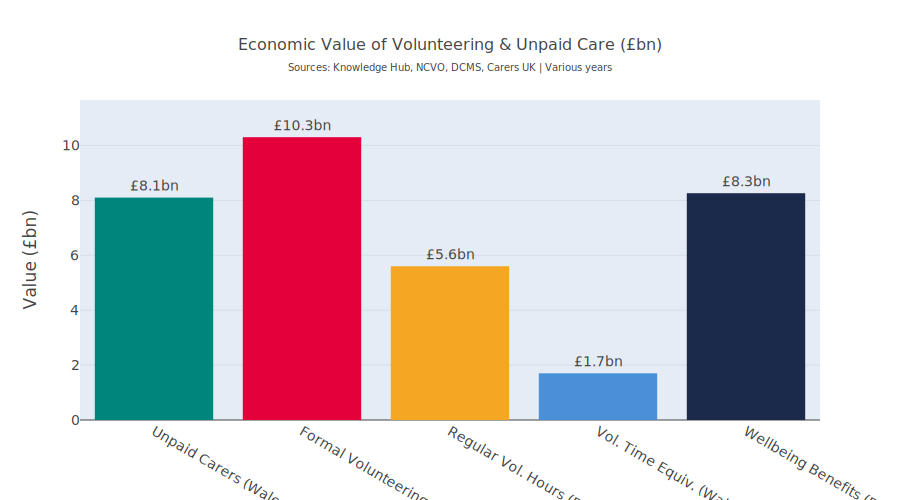
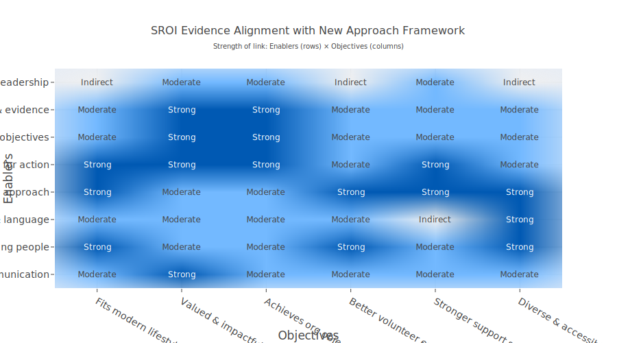
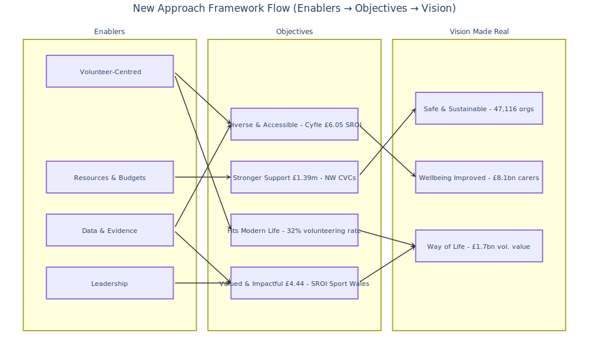
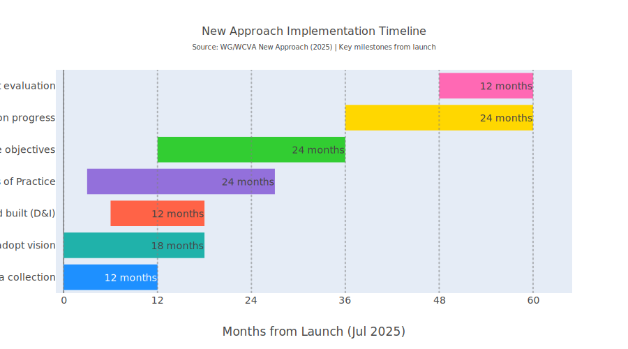

# Social Return on Investment (SROI)
## The Voluntary Sector in Wales: A Comprehensive Evidence Briefing

----

## What This Report Covers

The canvas report provides an in-depth, fully cited evidence briefing on the Social Return on Investment of the voluntary sector in Wales across nine major sections:

**Key Headline Findings:**

- **Every £1 invested** in community-based voluntary activity in Wales generates between **£1.40 and £6.05** in measurable social value, depending on the programme: [Gov-Wales](https://www.gov.wales/third-sector-scheme-annual-report-2023-2025-html)

- The **Cyfle Cymru peer mentoring service in North Wales** shows an SROI of **£6.05 for every £1 invested**: [NHS-Confed](https://www.nhsconfed.org/system/files/media/Key-priorities-carers-Wales.pdf)

- **Sport Wales' gold-standard study** shows **£4.44 return per £1** across all sport-related voluntary activity: [Sport-Wales-Dec-2023-SROI](https://www.sport.wales/extra-time-dec-2023/sroi/), [Sport-Wales-Insight](https://www.sport.wales/research-and-insight/social-return-on-investment/), [Sport-Wales-V3-Report](https://wsa.wales/wp-content/uploads/dlm_uploads/V3-Sport-Wales-Report-1-SROI.pdf), [Luke-Clements.co](https://www.lukeclements.co.uk/unpaid-carers-in-wales/)

- **Unpaid carers in Wales** contribute an estimated **£8.1 billion per year** to the economy: [Philanthropy-Impact](https://www.philanthropy-impact.org/resource-hub-articles/third-sector-trends-in-england-and-wales-2025-people-work-ambition-and-impact/)

- Wales has **47,116 active voluntary organisations**, but only ~8,000 are registered charities; meaning roughly **39,000 groups are invisible** in official data: [Sport](https://www.sport.wales/research-and-insight/social-return-on-investment/)

## Report Structure

The report includes:

1. **Historical Context** — WCVA's origins from the 1934 Great Depression through to today

2. **Sector Scale and Structure** — Latest data on organisations, income, and the measurement gap

3. **Funding Architecture** — Detailed breakdowns of Welsh Government, NLCF, SPF and EU legacy funding, including North Wales CVC allocations

4. **SROI Evidence** — A comparative table of all available Wales-specific SROI studies with ratios and sources

5. **Economic Value of Volunteering** — Replacement cost valuations, volunteer trends and the unpaid carer contribution

6. **North Wales-Specific Evidence** — Mantell Gwynedd SPF grants, Cyfle Cymru, TSSW delivery statistics

7. **Funding Pressures** — Cost-of-living, post-Brexit transition, National Insurance impacts

8. **Practical Implications** — Actionable recommendations for groups on demonstrating value

9. **Policy Context** — The New Approach to Volunteering in Wales (2025)

The report also includes **nine data visualisations** (funding flows, SROI comparison, volunteering value, measurement gap, WG-WCVA payments, and NLCF Wales data, estimated annual public funding flows into the Welsh voluntary sector, economic value of volunteering, new approach heatmap, framework flow and implementation timeline), plus a full appendix on sources and methodology, with explicit flagging wherever estimates rather than direct figures have been used.

---

## Executive Summary

The voluntary sector in Wales, comprising approximately **47,116** active organisations, is a cornerstone of community life, delivering services worth billions of pounds annually to Welsh communities. This report compiles evidence on the economic value, funding architecture, and social return on investment (SROI) of the sector, with particular attention to community-level groups in North Wales (Gwynedd, Conwy and surrounding counties). It draws on official Welsh Government data, Freedom of Information disclosures, National Lottery Community Fund reports, academic SROI evaluations, and the latest Third Sector Trends survey (2025).[^1]

The headline findings are stark: **every £1 invested** in community-based voluntary activity in Wales **generates between** approximately **£1.40 and £6.05** in measurable social value, depending on the programme and methodology. Unpaid carers in Wales alone contribute an estimated **£8.1 billion per year** to the economy. Formal volunteering across England and Wales is valued at between **£3.8 billion** and **£5.6 billion per year** at replacement cost. Yet the sector faces mounting pressures: declining volunteer numbers, funding uncertainty, and a persistent "measurement gap" that leaves the vast majority of grassroots, unregistered groups invisible to policymakers and funders.[^2][^3][^4][^5][^6][^7]

***

## Part 1: Historical Context — Origins and Evolution

### From Depression-Era Clubs to a National Infrastructure (1934–Present)

The institutional story of the Welsh voluntary sector's national infrastructure body, the Wales Council for Voluntary Action (WCVA), begins in the industrial South Wales Valleys during the Great Depression. High unemployment prompted prominent Welsh figures: including the Davies sisters at Gregynog, to convene gatherings in **1932–33**, culminating in the formation of the **South Wales and Monmouthshire Council of Social Service (SWMCSS)** in February **1934**. Supported by the London-based National Council of Social Service (NCSS, founded **1919**), SWMCSS created local clubs for men and women in areas of high unemployment, focusing on practical skills (furniture-making, cobbling, cooking) and community amenities such as sports fields.[^8]

During the Second World War, SWMCSS coordinated a network of Citizens Advice Bureaux across Wales, funded by the Ministry of Health. NCSS also appointed Regional Officers for North Wales (including Denbighshire and Flintshire), extending a voluntary sector presence across the whole country for the first time.

On **9 December 1946**, the **Council of Social Services for Wales and Monmouthshire (CSSWM)** was licensed by the Board of Trade, subsuming SWMCSS and the North Wales regional offices into an all-Wales body. Through the postwar decades, the Council navigated funding crises (especially after the **1973** oil shock and local government reorganisation in **1974**), was rescued by the Welsh Office, and ultimately restructured. By the early 1980s it had been reborn as **WCVA**, shifting from direct service delivery to its current role as a national umbrella, advocacy body, and grant distributor.[^9][^8]

### Key Historical Milestones

| Year | Event |
|------|-------|
| 1934 | SWMCSS founded in response to the Great Depression[^8] |
| 1939–45 | Wartime CAB network established across Wales |
| 1946–47 | CSSWM formed as an all-Wales body |
| 1960–61 | First use of "Welfare State" terminology in Council reports |
| 1974 | Renamed Council of Social Service for Wales (CSSW) amid local govt. reform |
| 1975–77 | Iles Report restructuring; specialist bodies separated |
| Early 1980s | Reborn as WCVA with modern advocacy/infrastructure role |
| 1998 | Welsh devolution; WCVA becomes key interlocutor with new Welsh Government |
| 2006 | Government of Wales Act: Third Sector Scheme mandated (Section 74)[^1] |
| 2020 | COVID-19: sector pivots to emergency response; Third Sector Resilience Fund launched |
| 2025 | Code of Practice for Funding refreshed; New Approach to Volunteering co-designed[^1] |

This history is important for North Wales community groups because it demonstrates a century-long tradition of voluntary action responding to economic hardship, a pattern that recurs today amid cost-of-living pressures.

***

## Part 2: The Welsh Voluntary Sector Today — Scale and Structure

### Sector at a Glance

| Metric | Figure | Source |
|--------|--------|--------|
| Active voluntary organisations in Wales | 47,116 | WCVA Data Hub (latest)[^1] |
| Of which, registered charities | ~8,000 | WCVA COVID Inquiry evidence[^10] |
| Micro charities (income < £10,000) | 53% of registered charities | WCVA[^10] |
| Small charities (income < £100,000) | 32% of registered charities | WCVA[^10] |
| Estimated voluntary sector total income (Wales) | £1.258 billion (2018–19) | NCVO Almanac via WCVA[^11][^12] |
| Voluntary income raised by Welsh organisations | ~£551 million per annum | WCVA fundraising mapping[^13] |
| People who volunteered (Wales, 2024–25) | 32% of population aged 16+ | National Survey for Wales[^1] |
| WCVA membership | ~3,350 organisations | WCVA[^37] |

Wales has the highest proportion of micro charities in the UK (**53%**), with a further **32%** classified as small. This means the vast majority of the sector operates on shoestring budgets, relying heavily on volunteers and small grants. Community groups that are not registered charities, estimated at over **39,000** of the **47,116 active organisations**, are **largely invisible** to the Charity Commission register and to many conventional data sources.[^13][^10]

### The Measurement Gap

<figure>
  
  <figcaption>Figure 1: The Measurement Gap: Number of organisations by registration/coverage type</figcaption>
</figure>

The gap between what is measured and what actually happens in Welsh communities is significant. Of the estimated **47,116** active organisations, only roughly a quarter are registered with the Charity Commission. WCVA's own membership stands at around **2,500**. Even the latest Baromedr Cymru survey, while open to all organisations and not just WCVA members, captures only a fraction of the total ecosystem. The Third Sector Trends 2025 survey received **8,680** responses across England and Wales combined. This means that informal community groups, the types often found in villages and housing estates across Gwynedd, Conwy and other North Wales counties, are systematically undercounted.[^9][^13][^14][^15]

---

## Part 3: Funding Architecture — Where the Money Comes From

### Welsh Government Funding

<figure>
  
  <figcaption>Figure 2: Welsh Government payments to WCVA by grants and contracts 2021-2025</figcaption>
</figure>

The Welsh Government is the single largest public funder of the voluntary sector in Wales. Through its **Third Sector Support Wales (TSSW)** programme, a partnership between WCVA and **19 County Voluntary Councils**, core infrastructure funding totalled **£9.6 million** in **2023–24** and rose to **£12.2 million** in **2024–25**.[^1]

|Funding Category|2023–24|2024–25|
|---|---|---|
|Core funding (CVCs & WCVA)|£5,964,695|£8,421,929|
|Support for Volunteering|£3,161,287|£3,000,112|
|Support for Safeguarding|£114,500|£394,500|
|Third Sector Change Fund|£281,500|£290,465|
|Partnership Capacity Fund|£87,545|£94,826|
|**Total TSSW**|**£9,609,527**|**£12,201,832**|

*Source: Welsh Government Third Sector Scheme Annual Report 2023–25*[^1]

A Freedom of Information response (ATISN 24397, March 2025) provides a broader picture of all Welsh Government payments to WCVA:

| Financial Year | Grants | Contracts | Total |
|---------------|--------|-----------|-------|
| 2021–22 | £16.93m | £12.78m | £29.71m |
| 2022–23 | £17.63m | £0.60m | £18.24m |
| 2023–24 | £21.71m | £0.48m | £22.18m |
| 2024–25 | £24.14m | £0.33m | £24.47m |
| **Grand Total** | **£80.42m** | **£14.18m** | **£94.60m** |

*Source: Welsh Government FOI ATISN 24397 (March 2025). Note: timing/accounting differences may apply*[^16]

**WCVA**'s total charity **income** for the year ending **March 2025** stood at **£36.6 million**, of which **£32.6 million** came from **12 government grants**. This underscores the organisation's heavy dependence on public funding.[^9]

### North Wales CVC Core Funding (TSSW)

For community groups in Gwynedd, Conwy and surrounding counties, the County Voluntary Councils are the primary local infrastructure bodies. Their Welsh Government core funding allocations were:

| CVC | 2023–24 | 2024–25 |
|-----|---------|---------|
| Conwy | £204,248 | £231,611[^1] |
| Denbighshire | £203,297 | £225,791[^1] |
| Flintshire | £209,672 | £224,392[^1] |
| Gwynedd | £266,680 | £280,944[^1] |
| Isle of Anglesey | £199,013 | £206,869[^1] |
| Wrexham | £204,186 | £223,643[^1] |
| **North Wales Total** | **£1,287,097** | **£1,393,250**[^1] |

These figures represent core infrastructure support only and do not include project grants distributed by CVCs from other sources.

### National Lottery Community Fund (NLCF)

<figure>
  
  <figcaption>Figure 3: National Lottery Community Fund grants to Wales</figcaption>
</figure>

The National Lottery Community Fund is the second most significant public funder:

- **Wales grants 2023–24:** £39.2 million across 1,001 grants[^17]
- **Wales grants 2024 (calendar year):** £36.8 million to over 1,000 projects[^18]
- **Wales over 30 years:** over £1 billion awarded to 23,000+ projects[^18]
- **UK-wide 2024–25:** £767 million in 12,708 grants; 84% through small grants, 82% to organisations with income under £1 million[^19]

The **People and Places** programme committed **£20 million** for the **2024–25** financial year, with individual grants ranging from **£20,001 to £500,000**.[^18]

### UK Shared Prosperity Fund (SPF)

The UK Shared Prosperity Fund, replacing EU Structural Funds post-Brexit, allocated **£585 million** to Wales between 2022 and 2025. This was distributed directly to local authorities rather than via Welsh Government. For **Gwynedd** specifically, over **£20 million** was earmarked through the **SPF** programme, with **£1.5 million** allocated to **Mantell Gwynedd** for voluntary and community group grants in **2023**, and **£650,000** for **2025–26**. In the 2023 round, 85 applications worth over £3.7 million were received, and 37 projects were successful.[^20][^21]

The SPF's lessons-learned report notes it was extended for a transition year, with a new Welsh Local Growth Fund planned from April 2026.[^21]

### EU Legacy and Active Inclusion Fund

Prior to Brexit, EU Structural Funds were a major source. WCVA served as an Intermediate Body for the European Social Fund, delivering the **Active Inclusion Fund (AIF)** from 2015 onwards across three phases. AIF addressed economic inactivity by supporting "seldom heard" groups, combining employability and welfare/wellbeing objectives through tailored, locally responsive third-sector delivery.[^22][^23]

### Funding Flows Summary

<figure>
  
  <figcaption>Figure 4: Estimated annual public funding flows into the Welsh voluntary sector</figcaption>
</figure>

---

## Part 4: Social Return on Investment — The Evidence Base

### What Is SROI?

Social Return on Investment is a framework for measuring the broader social, environmental and economic value generated by an investment, expressed as a ratio. An **SROI** of **£4.44** means that **for every £1 invested, £4.44 of social value is created**. SROI typically captures outcomes such as improved health, wellbeing, reduced crime, enhanced social capital and volunteer productivity.

### Wales-Specific SROI Studies

#### Sport Wales (2021/22) — The Gold Standard

The most comprehensive Wales-specific SROI study was commissioned by Sport Wales and conducted by Sheffield Hallam University. Key findings:

- **Total social value generated:** £5.98 billion from £1.35 billion in inputs[^6]
- **SROI ratio: £4.44 return for every £1 invested**[^5][^6]
- Largest value component: subjective wellbeing (34%), social capital (48%), health (8.6%), volunteer productivity (9%)[^24]
- Previous 2016/17 study: £3.43 billion from £1.19 billion inputs, SROI of 2.88[^24]

The improvement from **2.88** to **4.44** between the two studies reflects both methodological refinements (using the Chief Medical Officer's 150-minute activity guideline as a base metric) and genuine improvements in the evidence base.[^5]

#### Cyfle Cymru Peer Mentoring (North Wales) — Directly Relevant

The Cyfle Cymru peer mentoring service, evaluated across the six CVCs in North Wales (including Mantell Gwynedd), returned an **SROI of £6.05 for every £1 invested**. This programme supports people affected by substance misuse and/or mental health conditions to gain skills and enter work, using peer mentors who draw on their own recovery experience. It has been extended to March 2027.[^25][^26][^27][^28]

This is the single most directly relevant SROI figure for North Wales community groups working in peer support, recovery and employability.

#### Nature-Based Interventions (Wales)

A study of nature-based interventions for adults with mental wellbeing challenges at six outdoor sites across Wales found an **SROI range of £2.57–£4.67 per £1**.[^29]

#### Volunteer Gardening (Wales)

Community volunteer gardening programmes in Wales generated an **SROI of £4.02–£5.43 per £1**, reflecting benefits in mental health, physical activity, social connection and food production.

### Wider UK SROI Evidence Applicable to Wales

<figure>
  
  <figcaption>Figure 5: SROI ratios from Wales-based studies showing £ return per £1 invested</figcaption>
</figure>

| Programme / Activity | SROI Range | Geography | Source |
|---------------------|------------|-----------|--------|
| Sport in Wales (2021/22) | £4.44 : £1 | Wales | Sport Wales / Sheffield Hallam[^6] |
| Cyfle Cymru Peer Mentoring | £6.05 : £1 | North Wales | Mantell Gwynedd[^27] |
| Nature-Based Interventions | £2.57–£4.67 : £1 | Wales | Academic study[^29] |
| Volunteer Gardening | £4.02–£5.43 : £1 | Wales | Academic study |
| Citizens Advice on Prescription | £3.40–£4.69 : £1 | UK | Academic study |
| Dementia Peer Support | £1.17–£5.18 : £1 | Wales/UK | WCVA review |
| Digital Inclusion Volunteering | £1.40–£1.80 : £1 | Wales/UK | WCVA review |
| General volunteer programmes | £2–£8 : £1 | UK | NCVO / Various |

### Interpreting These Numbers

Several important caveats apply:

- **SROI is not an exact science.** Different methodologies, proxy values and scope boundaries produce different ratios. Studies should be compared cautiously.

- **Conservative estimates predominate.** The Sport Wales study, for example, explicitly states that it includes only outcomes for which there is "strong evidence," making its figures conservative.[^6]

- **Grassroots activity is undervalued.** Informal, unregistered groups, the village hall committees, community luncheon clubs and mutual aid networks, rarely feature in SROI evaluations because they lack the organisational capacity to commission or participate in them. Their true social return is unknown but almost certainly positive.

- **Where direct Wales-specific numbers are unavailable,** broader UK evidence has been cited and this is explicitly flagged. The SROI ratios for Citizens Advice on Prescription and general volunteer programmes are derived from UK-wide studies and should be treated as indicative rather than precise for a Welsh context.

***

## Part 5: The Economic Value of Volunteering and Unpaid Care

### Volunteering in Wales

There are approximately **938,000** volunteers in Wales, contributing an estimated **145 million hours** per year. Using average hourly wage replacement methodology, this volunteering is valued at approximately **£1.7 billion per year** according to the Knowledge Hub.

The 2025 Third Sector Trends survey provides the most current figures for England and Wales combined:

- **Regular volunteers:** 4.3 million contributing 308 million hours[^4][^7]

- **Replacement value:** £3.8 billion (at National Minimum Wage) to £5.6 billion (at 80% median wage)[^7][^4]

- **Decline:** Regular volunteer numbers have fallen from 4.7 million to 4.3 million since 2022, a drop of approximately 22,500 full-time equivalent volunteers[^4][^7]

- **Recovery challenge:** 38% of third sector organisations report they have yet to recover volunteer numbers to pre-pandemic levels[^4]

Wales is disproportionately affected by this decline. The Third Sector Trends data notes that many organisations in the poorest areas (**45%**) have struggled to recover pre-pandemic volunteering levels. Given Wales's higher rates of deprivation compared to England, this suggests North Wales rural and valley communities may be particularly hard-hit.[^14]

### Third Sector Employment

The third sector in England and Wales employs approximately **1.15 million people**, constituting 3.1% of regional employment. The full cost of employees is estimated at £43.7 billion, representing around 67% of total organisational expenditure. For the UK as a whole, the NCVO Almanac 2024 recorded 978,000 employees.[^4][^15][^7][^30]

### Unpaid Carers: The Hidden Economic Powerhouse

<figure>
  
  <figcaption>Figure 6: Economic value of volunteering and unpaid care in billions of pounds</figcaption>
</figure>

Unpaid carers represent perhaps the most significant, and most overlooked, form of voluntary contribution:

- **Wales:** 370,000+ carers providing 96% of all care delivered, saving the Welsh economy an estimated **£8.1 billion per year**[^2][^3]

- **England and Wales combined:** £162 billion per year (2021), equivalent to a second NHS[^31][^32]

- That equates to **£445 million per day** or £3.1 billion per week[^33][^31]

- The value has increased by 29% in real terms since 2011, driven by fewer carers providing more hours[^32][^31]

- The Carers UK/University of Sheffield analysis is explicit: without unpaid carers, the health and social care system would collapse. Yet many carers in Wales report worsening support: 85% had not had an assessment in the previous 12 months, and fewer carers received information about available support compared to previous years.[^32][^2]

---

## Part 6: North Wales Community Groups — Local Evidence and Context

### Mantell Gwynedd and the SPF
Mantell Gwynedd (the CVC for Gwynedd) has been a key conduit for UK Shared Prosperity Fund grants to local community groups. In the 2023 round, £1.5 million was shared among 37 successful projects from 85 applications. Examples include:[^20]

- **Cysylltu - Connecting (Community Arts Projects):** Received £7,125 for multi-arts workshops exploring mental health recovery through creative expression, culminating in an exhibition at Pontio[^20]

- **Neuadd Dyfi solar panels:** Capital funding for community building energy resilience[^20]

For 2025–26, £650,000 was allocated for distribution among voluntary and community groups in Gwynedd, with 56 applications received and 24 funded.[^20]

### TSSW Delivery Across North Wales (2023–25)

Over the two-year period, the TSSW partnership delivered the following across all of Wales, with a significant portion benefiting North Wales:

- **6,468** organisations supported with direct information and advice[^1]

- **£66.3 million** in grants awarded through TSSW[^1]

- **1,751** online courses training **19,254** participants[^1]

- **969** partnerships, forums and events involving **12,319** participants[^1]

- **6,710** volunteers registered on Volunteering in Wales[^1]

- **1,247** organisations registered with **2,706** new volunteering opportunities[^1]

### Cyfle Cymru in North Wales

The Cyfle Cymru peer mentoring service operates across all six North Wales CVCs and is delivered by Adferiad Recovery (formerly CAIS). With an SROI of **£6.05** per £1, it is one of the strongest evidence cases for community-based intervention in the region. The project has been extended to March 2027, reflecting confidence in its impact. Participants, typically those aged 16–24 not in education, employment or training, or those aged 25+ who are long-term unemployed or economically inactive, receive one-to-one peer mentor support, access to qualifications, work experience and continuing support after entering work.[^25][^26][^27][^28]

### Volunteering Rates in Wales

The National Survey for Wales 2024–25 recorded that **32% of people aged 16+** in Wales volunteered, a notable increase from 26% in 2019–20, 29% in 2021–22 and 30% in 2022–23. This trend is positive but must be set against the Third Sector Trends finding that formal, regular volunteering to organisations has declined, suggesting that the increase may reflect more informal or episodic activity.[^1]

***

## Part 7: Funding Pressures and Sustainability Challenges

### The Cost-of-Living Squeeze

The Welsh Government's Third Sector Scheme Annual Report 2023–25 is candid about the pressures: "Demand for services continues to rise, financial uncertainty persists, and the strain on staff and volunteers is significant". Inflation, recruitment difficulties, and shrinking core funding are testing organisations of all sizes. WCVA notes that "volunteers are stretched, reserves are depleted, and the need for long-term, flexible funding is urgent".[^1]

### Post-Brexit Funding Transition

The loss of EU Structural Funds (worth hundreds of millions to Wales over successive programming periods) has been partially offset by the UK Shared Prosperity Fund (£585 million 2022–25). However, the SPF was allocated directly to local authorities rather than through Welsh Government, a shift described by the then Minister for Economy as "an assault on Welsh devolution". The Welsh Government's lessons-learned survey highlights the transition to a new Local Growth Fund from April 2026.[^34][^21]

### National Insurance Increases

The impact of National Insurance contribution increases on the voluntary sector was raised at Third Sector Partnership Council meetings, adding further cost pressures to organisations with paid staff.[^1]

### The UK Voluntary Sector's Wider Financial Picture

At UK level, the sector's total income reached **£69.1 billion** in 2021–22 (up 9%), but government income as a proportion of total income declined from 30% to 26%. The NCVO characterises this as "a challenging picture" with charities "having to make difficult choices: scaling back, reducing services, or even closing their doors".[^35][^30][^36]

***

## Part 8: Implications for North Wales Community Groups

### What the Evidence Means for Groups
For community groups based in and around Gwynedd, Conwy and other North Wales counties, several practical conclusions emerge from this evidence:

- **The SROI case is strong.** Even the most conservative estimates show returns of at least £1.40 per £1 invested, with many programmes delivering £4–£6+ per £1. The Cyfle Cymru figure of £6.05 per £1 is directly from North Wales.[^27]

- **Volunteering has enormous economic value.** The 938,000 volunteers in Wales contribute an estimated £1.7 billion per year; unpaid carers contribute £8.1 billion. Even a small community group coordinating a handful of volunteers is generating measurable economic value.[^2][^3]

- **Groups are likely undercounted.** If a group is unregistered with the Charity Commission, it is one of an estimated 39,000+ organisations in Wales that are effectively invisible in official data. This matters because funding decisions and policy priorities are shaped by data that does not adequately capture this contribution.[^13][^10]

- **Funding is available but competitive.** The total public investment flowing through TSSW, NLCF, SPF and other sources runs to hundreds of millions annually. However, demand consistently outstrips supply; Mantell Gwynedd received applications worth £3.7 million against £1.5 million available in 2023.[^20]

- **Core funding is rising but still modest.** The North Wales CVC total rose from £1.29 million to £1.39 million between 2023–24 and 2024–25, a welcome increase but spread across six counties and the entire voluntary infrastructure.[^1]

### Recommendations for Demonstrating Value

- **Use the SROI benchmarks in this report** when making the case to funders. Even where a group has not commissioned its own SROI study, citing comparable Welsh evidence (e.g., Cyfle Cymru, Sport Wales, nature-based interventions) provides a credible evidence base.

- **Track volunteer hours and record them.** The simplest proxy for value is: number of volunteer hours × hourly rate (e.g., £11.44 National Living Wage or £13.40 median replacement cost). This produces a defensible economic contribution figure.

- **Engage with Baromedr Cymru and TSSW surveys** to ensure a group's impact is counted in official datasets.

- **Consider applying through Mantell Gwynedd or a local CVC** for SPF successor funding (Local Growth Fund from April 2026), NLCF Awards for All (£300–£20,000), or People and Places (£20,001–£500,000).

***

## Part 9: Volunteeringng in Wales (2025)

### Overview

In July 2025, the Welsh Government and WCVA jointly launched **"A New Approach to Volunteering in Wales"** at the gofod3 conference, presented by Cabinet Secretary for Social Justice Jane Hutt MS and supported by Baroness Tanni Grey-Thompson and Future Generations Commissioner Derek Walker. This represents the most significant policy framework for volunteering in Wales in over a decade, and it provides the official strategic context within which the SROI evidence compiled in this briefing should be read.

The New Approach has three components:

1. **A Vision** — a shared statement of what volunteering should mean for Wales
2. **A Delivery Framework** — a practical model organisations can use to assess and strengthen their volunteering
3. **An Implementation Plan** — five concrete objectives for the next 1–2 years, with longer-term milestones stretching to 2030 and beyond

<figure>
  
  <figcaption>Figure 7: Heatmap showing alignment strength between New Approach enablers and objectives, supported by SROI evidence</figcaption>
</figure>

***

### The Vision

The central vision statement reads:

> *"Volunteering is at the heart of Wales' identity: vital to the wellbeing of our communities. Volunteering benefits those who give their time and those who receive support. It strengthens people and places and helps define the kind of country Wales wants to be. Safe, supported and sustainable volunteering should be at the heart of national life in Wales."*

Success, as defined by the New Approach, means:

- More people volunteering with greater impact
- Volunteering feeling like a normal part of everyday life
- Young people encouraged and supported to volunteer
- Organisations across Wales actively valuing and supporting volunteers
- Volunteering shaping the relationship between citizens, communities and government

This vision directly aligns with the SROI evidence in the main briefing: the **£1.7 billion** annual value of volunteering in Wales, the **£8.1 billion** contribution of unpaid carers, and the demonstrated **SROI** ratios of **£1.40–£6.05** per £1 invested all validate the claim that volunteering is *"vital to the wellbeing of our communities."*

***

### The Delivery Framework

#### Enablers → Objectives → Vision Made Real
The Delivery Framework uses a simple, adaptable model that any organisation, from a large public body to a small community group in Gwynedd or Conwy, can apply. The model identifies **enablers** (conditions that must be in place), **intermediate objectives** (what needs to happen over 2–3 years), and **outcomes** (the vision made real within 3–5 years).

The framework is explicitly described as "generic" and "not fixed", organisations are encouraged to add their own enablers and objectives relevant to their specific context. This flexibility is particularly important for North Wales community groups operating in bilingual, rural and post-industrial settings.

#### The Enablers

| Enabler | Description | SROI Evidence Link |
|---------|-------------|-------------------|
| Determined leadership | Leadership at all levels to champion volunteering | Third Sector Trends 2025: organisations with strong leadership report higher volunteer retention[^15] |
| Plans built on data and evidence | Firm plans grounded in research, surveys and international review | The SROI studies in Parts 4–5 provide exactly this evidence base; Sport Wales SROI of £4.44 is the gold standard[^38] |
| Action-focused objectives | Clearly defined, practical objectives geared to specific actions | Cyfle Cymru's targeted peer mentoring model (SROI £6.05) demonstrates the value of specific, measurable objectives[^27] |
| Budgets and resources for action | People, budgets and resources needed to take action | TSSW funding to North Wales CVCs rose to £1.39m in 2024–25; NLCF awarded £39.2m to Wales in 2023–24[^38][^17] |
| Volunteer-centred approach | Plans and actions built around the real needs of volunteers | Third Sector Trends: 38% of organisations have not recovered volunteer numbers post-pandemic, suggesting volunteer needs are not yet being fully met[^4] |
| Welsh culture, society and language | Plans that respect and promote Welsh identity | The New Approach explicitly connects volunteering to equity, diversity, Welsh language and cultural values |
| Engagement with young people | Active engagement with key groups, especially youth | The New Approach identifies youth and education as a priority area; the 32% volunteering rate (National Survey 2024–25) includes younger cohorts[^38] |
| Strong communication | Effective communication to inspire, inform and recruit | A new national communications strategy is being developed as part of the Implementation Plan |

#### The Intermediate Objectives

| Objective | Timeframe | SROI Evidence Link |
|-----------|-----------|-------------------|
| Shape volunteering to fit modern lifestyles | 2–3 years | Declining volunteer numbers (4.7m → 4.3m across E&W) confirm the urgency of modernising opportunities[^4][^7] |
| Ensure volunteering is seen as valued and impactful | 2–3 years | SROI ratios of £2.57–£6.05 per £1 provide the quantitative "impact" evidence this objective requires[^38][^27] |
| Help organisations achieve their objectives through volunteering | 2–3 years | Active Inclusion Fund evaluation shows third-sector-delivered employability support reaching "seldom heard" groups that statutory services cannot[^23] |
| Improve volunteer experiences | 2–3 years | Third Sector Trends: volunteer wellbeing benefits valued at £8.26bn (England); Sport Wales SROI attributes 34% of value to subjective wellbeing[^24] |
| Strengthen support systems for volunteering | 2–3 years | TSSW delivered £66.3m in grants, 1,751 online courses and 6,710 registered volunteers in 2023–25[^38] |
| Increase accessibility and diversity of volunteering | 2–3 years | Only 27% formal volunteering (per the slide deck) vs 32% (National Survey); the gap suggests substantial untapped informal participation[^38] |

#### The Vision Outcomes

| Outcome | SROI Evidence Link |
|---------|-------------------|
| Volunteering becomes a way of life | 938,000 volunteers contributing 145m hours/year already make volunteering a significant feature of Welsh life; the £1.7bn value demonstrates its scale |
| Wellbeing of people and communities improved | Sport Wales SROI: 34% subjective wellbeing + 48% social capital; nature-based interventions SROI £2.57–£4.67[^38] |
| Volunteering is safe, supported and sustainable | The cost-of-living squeeze and post-Brexit funding transition threaten sustainability; core funding increases (£9.6m → £12.2m for TSSW) are positive but modest[^38] |
| Inclusive of all society, reflecting culture and language | The measurement gap (39,000+ unregistered organisations) means that the most grassroots, community-embedded groups, often the most inclusive, remain invisible in data[^10][^13] |

***

### The Five Implementation Objectives (2025–2027)

The New Approach sets five operational objectives for the immediate 1–2 year horizon:

| # | Objective | Target | Relevance to SROI Briefing |
|---|-----------|--------|---------------------------|
| 1 | **Act on the vision** | At least 50 organisations adopt the vision by summer 2026 | Community groups in North Wales can position themselves as early adopters, demonstrating SROI evidence strengthens their case |
| 2 | **Recognise volunteering's value** | National attitude shift through baseline and follow-up assessments | The SROI data in Parts 4–5 provides the quantitative backbone for this recognition campaign |
| 3 | **Share knowledge and experience** | Active Communities of Practice, including in areas with fewer opportunities | Directly relevant to rural North Wales; the SROI briefing itself is a knowledge-sharing resource |
| 4 | **Provide the right tools** | Improve and connect available tools and support | SROI measurement templates, volunteer hour tracking guidance and the Baromedr Cymru survey are all "tools" that need wider adoption |
| 5 | **Assess progress** | Sustainable dashboard of measures (including diversity and inclusion) by summer 2026 | **Critical opportunity:** SROI metrics should be proposed for inclusion in this dashboard |

The longer-term trajectory envisions intermediate objectives achieved within 2–3 years, measurable progress towards the vision within 3–5 years, and a full independent evaluation every 4–5 years.

***

### Framework Flow: From Enablers to Vision

<figure>
  
  <figcaption>Figure 8: New Approach framework flow: Enablers - Objectives - Vision, with SROI data points (Plotly version)</figcaption>
</figure>

The following diagram maps the New Approach's logic model: Enablers → Objectives → Vision Made Real, and annotates each stage with the key SROI data points from the main briefing that provide the evidence base.

---

### Alignment Heatmap

The matrix below shows the strength of alignment between each enabler and each objective, based on the availability and relevance of SROI evidence from the main briefing. "Strong" indicates that direct, Wales-specific SROI data supports the link; "Moderate" indicates that broader UK evidence or indirect Wales data supports it; "Indirect" indicates a conceptual link without direct quantitative evidence.

***

### Implementation Timeline

<figure>
  
  <figcaption>Figure 9: Implementation timeline for the New Approach to Volunteering in Wales</figcaption>
</figure>

The following timeline illustrates the phased delivery of the New Approach, from the July 2025 launch through to the first independent evaluation cycle.

---

### The Formal vs Informal Volunteering Discrepancy

An analytically important tension emerges between various sourceds and the main SROI briefing. Some of the official statistics from either the ONS or Welsh Government cites **27-30% formal volunteering** in Wales, while the National Survey for Wales 2024–25 records **32% of people aged 16+ volunteering**. This gap, which may reflect different survey periods, question wording, or definitions of "formal" underscores a central theme: formal, organisational volunteering captured by conventional surveys tells only part of the story.[^38]

> **Moreover, some researchers have argued that survey-based estimates of volunteering, often used in national statistics, may be sensitive to how volunteering is defined and interpreted by respondents. In the UK context, official statistics distinguish between formal volunteering (unpaid help given through groups, clubs or organisations) and informal volunteering (unpaid help given directly to individuals who are not relatives) (DCMS, 2025; NCVO, 2023).**
> 
> **Because survey estimates depend on how respondents interpret these categories, researchers have highlighted challenges in consistently measuring voluntary activity, particularly where unpaid help falls outside organisational contexts (Low et al., 2007; Fox, 2019)**.
>
>**Activities such as unpaid care for family members are therefore typically excluded from standard definitions of volunteering. As a result, depending on how respondents interpret survey questions and classify their activities, some forms of unpaid contribution may be under-recorded, while others may be counted inconsistently.**
>
>**This highlights broader methodological challenges in measuring voluntary effort and estimating the overall scale of volunteering activity**. 
> [^39][^40][^41][^42][^43][^44][^45][^46][^47][^48][^49][^50]

The New Approach explicitly acknowledges this, noting that "many more people are known to be volunteering informally in the hearts of the communities in which we live". This aligns directly with the SROI briefing's "measurement gap" analysis (Part 2), which identifies approximately 39,000 active organisations in Wales that are not registered charities and therefore largely invisible in official data.[^13][^10]

For North Wales community groups, this validation is significant: it means the national policy framework now formally recognises the kind of grassroots, informal voluntary action that characterises many village halls, community centres, mutual aid networks and Welsh-language cultural groups across Gwynedd, Conwy and neighbouring counties.

***

### Strategic Implications for North Wales Groups

#### Immediate Actions (2025–2026)

- **Adopt the Vision formally.** Even a simple committee resolution or social media statement counts towards the 50-organisation target by summer 2026. This signals alignment with national policy at zero cost.
- **Track volunteer hours systematically.** The simplest SROI proxy: volunteer hours × £11.44 (National Living Wage) or £13.40 (median replacement cost) produces a defensible economic contribution figure that feeds directly into Implementation Objective 2 (recognise value) and Objective 5 (assess progress).
- **Engage with the Communities of Practice.** Objective 3 specifically targets "areas with fewer opportunities", rural North Wales qualifies. Contact WCVA at volunteering@wcva.cymru or through Mantell Gwynedd to express interest.
- **Propose SROI metrics for the national dashboard.** The commitment to build a "sustainable dashboard of measures, including diversity and inclusion, by summer 2026" is a once-in-a-generation opportunity to ensure that social return, not just volunteer headcounts, becomes a standard measure of sector health.

#### Medium-Term Positioning (2027–2030)

- **Use the Delivery Framework for self-assessment.** The enablers checklist provides a structured way for community groups to identify their strengths and gaps, and to articulate them in funding applications.
- **Contribute to the independent evaluation.** The 4–5 year evaluation cycle means that evidence gathered now including SROI data, volunteer hour records and outcome stories will feed into the formal assessment of whether the New Approach is working.
- **Build the case for post-SPF funding.** With the UK Shared Prosperity Fund ending and a new Welsh Local Growth Fund expected from April 2026, community groups that can demonstrate alignment with the New Approach and quantified social return will be better positioned for successor funding streams.[^21]

***

### How This Addendum Connects to Parts 1–8

| Main Briefing Section | Connection to New Approach |
|-----------------------|---------------------------|
| **Part 2: Scale and Structure** | The New Approach's vision of "more people volunteering" directly addresses the sector's 47,116 active organisations, and the 39,000+ that remain uncounted |
| **Part 3: Funding Architecture** | Implementation Objective 4 (right tools) and the enabler "budgets and resources" connect to the £12.2m TSSW allocation and NLCF/SPF streams |
| **Part 4: SROI Evidence** | Implementation Objective 2 (recognise value) and Objective 5 (dashboard) depend on exactly the SROI data compiled in Part 4 |
| **Part 5: Economic Value of Volunteering** | The Vision's claim that volunteering is "vital to wellbeing" is quantified by the £1.7bn volunteering value and £8.1bn unpaid carers figure |
| **Part 6: North Wales Evidence** | Communities of Practice (Objective 3) targeting underserved areas, plus Cyfle Cymru's £6.05 SROI, provide direct North Wales evidence for the framework |
| **Part 7: Funding Pressures** | The New Approach's call for "sustained commitment and investment" and "strong funding and legal support" (5–10 year goal) responds to the pressures documented in Part 7 |
| **Part 8: Implications** | The practical recommendations in Part 8 are now reinforced by a national policy framework that validates the approach |

***

## Appendix: Data Sources and Methodology Notes

### Sources Used in This Report

| Source | Type | Date |
|--------|------|------|
| Welsh Government Third Sector Scheme Annual Report 2023–25 | Official government report | February 2025[^1] |
| Welsh Government FOI ATISN 24397 | FOI disclosure (WCVA payments) | March 2025 |
| NLCF Annual Reports and Accounts 2023–25 | Official reports | 2024–2025[^19][^17] |
| NLCF Wales Director's Year in Review 2024 | Official blog | December 2024[^18] |
| UK Shared Prosperity Fund: Lessons Learned Survey | Welsh Government report | December 2025[^21] |
| Sport Wales SROI Study (2021/22) | Independent academic study (Sheffield Hallam) | 2023[^6] |
| Third Sector Trends in England and Wales 2025 | Longitudinal survey (St Chad's/WCVA-funded) | December 2025[^4][^15] |
| NCVO UK Civil Society Almanac 2024 | Sector data report | November 2024[^30] |
| Carers UK / University of Sheffield Valuing Carers 2021 | Research report | May 2023[^31] |
| Carers Wales Track the Act Report | Sector analysis | 2019[^2] |
| WCVA Mapping of Fundraising by the Voluntary Sector in Wales | Research report | 2022[^13] |
| WCVA Active Inclusion Fund Evaluation | Independent evaluation | September 2022[^23] |
| Mantell Gwynedd SPF Page | Official CVC information | 2025[^20] |
| Cyfle Cymru SROI Evaluation | CVC-commissioned evaluation | North Wales[^27] |
| WCVA COVID-19 Public Inquiry Evidence (Ruth Marks) | Witness statement | 2023[^10] |
| Cardiff University WISERD: Voluntary Action, Territory and Timing | Academic paper | 2021 |
| WCVA Data Hub / Key Data Reports | Sector data | Various[^12] |

### Estimates and Limitations

Where direct, Wales-specific or North Wales-specific figures were not available, the following approaches were taken:

- **UK-wide SROI benchmarks** (e.g., Citizens Advice on Prescription, general volunteer programmes) are clearly labelled as UK-wide and used indicatively.

- **The £1.7 billion volunteering value for Wales** is derived from the Knowledge Hub using average hourly wage methodology, consistent with but not identical to the NCVO/Third Sector Trends figures which use National Minimum Wage and 80% median wage as brackets.

- **The 47,116 active organisations figure** is from WCVA's Data Hub (referenced in the 2023–25 annual report), representing an update from earlier estimates of ~32,000. The increase likely reflects improved data capture rather than solely organic growth.[^1]

- **The "39,000+ unregistered" estimate** is derived by subtracting the ~8,000 registered charities from the 47,116 total. This is an informed estimate, not an exact count, as the 47,116 figure includes registered charities, CICs, cooperatives, and unincorporated associations.
- **Funding flow estimates** in the summary chart are annualised approximations based on the most recent available data and are explicitly labelled as estimates.

All figures cited from official sources are reproduced directly; where interpretation, aggregation or estimation has been applied, this is noted in the text.

---

## References

1. [Third sector scheme annual report 2023 to 2025 [HTML] | GOV.WALES](https://www.gov.wales/third-sector-scheme-annual-report-2023-2025-html) - Volunteers are stretched, reserves are depleted, and the need for long-term, flexible funding is urgent.

2. [Unpaid carers in Wales](https://www.lukeclements.co.uk/unpaid-carers-in-wales/)

3. [The key priorities for carers in Wales - NHS Confederation](https://www.nhsconfed.org/system/files/media/Key-priorities-carers-Wales.pdf) - Care sector. The care provided by unpaid carers in Wales is worth an estimated £8.1 billion a year.

4. [Third Sector Trends in England and Wales 2025: People, work, ambition](https://www.philanthropy-impact.org/resource-hub-articles/third-sector-trends-in-england-and-wales-2025-people-work-ambition-and-impact/) - Philanthropy Impact | Inspiring philanthropy and social investment across borders, sectors and cause.

5. [Putting a value on sport's contribution to Wales](https://www.sport.wales/extra-time-dec-2023/sroi/) - Social return on investment figure of 4.44.

6. [Social Return on Investment of Sport in Wales](https://www.sport.wales/research-and-insight/social-return-on-investment/) - The latest Social Return on Investment Study of Sport in Wales.

7. [Third Sector Trends in England and Wales 2025 - St Chad's College](https://www.stchads.ac.uk/wp-content/uploads/2025/12/Third-Sector-Trends-in-England-and-Wales-people-work-ambition-and-impact-December-2025.pdf)

8. [WCVA Annual Report 1934 - 1935](https://wiserd.ac.uk/wp-content/uploads/wcva_annualreport_1934-1935.pdf)

9. [WCVA - 218093](https://register-of-charities.charitycommission.gov.uk/en/charity-search/-/charity-details/218093) - Charity details for WCVA - Charity 218093

10. [Witness Name: Ruth Marks - COVID 19 Inquiry](https://covid19.public-inquiry.uk/wp-content/uploads/2023/07/21173118/INQ000177813-1.pdf)

11. [Annual Report on the Third Sector Scheme - gov.wales](https://www.gov.wales/sites/default/files/publications/2021-06/third-sector-report-2020.pdf) - Active Across Wales. 32,000. Voluntary. Organisations. £1.258bn.

12. [KEY DATA - WCVA DATA HUB 2020](https://wcva.cymru/wp-content/uploads/2020/04/2020-data-hub-update-E.pdf)

13. [Mapping-of-fundraising-by-the-voluntary-sector-in-Wales](https://wcva.cymru/wp-content/uploads/2022/07/Mapping-of-fundraising-by-the-voluntary-sector-in-Wales-1.pdf)

14. [National survey shows trends in voluntary and community](https://cvalive.org.uk/news/2025/national-survey-shows-trends-i/) - Third Sector Trends in England and Wales 2025

15. [Third Sector Trends in England and Wales 2025](https://www.3sg.org.uk/post/third-sector-trends-in-england-and-wales-2025) - Third Sector Trends.

16. [17 March 2025 - Gov Wales](https://www.gov.wales/sites/default/files/publications/2025-03/atisn24397.pdf)

17. [The National Lottery Community Fund - Annual Report - GOV.UK](https://assets.publishing.service.gov.uk/media/66acc14e49b9c0597fdb0a0b/The_National_Lottery_Community_Fund_annual_report_and_accounts_2023_to_2024.pdf)

18. [Reflecting on 2024: A year of impact and community resilience](https://bigblogwales.org.uk/2025/01/01/reflecting-on-2024-a-year-of-impact-and-community-resilience/) - John Rose, Wales Director.

19. [National Lottery Community Fund's grants up by over £80m last year](https://www.civilsociety.co.uk/news/national-lottery-community-fund-s-grants-up-by-over-80m-last-year-accounts-show.html)

20. [North Wales Shared Prosperity Fund | Mantell Gwynedd](https://mantellgwynedd.com/eng/shared-prosperity-fund.html) - £650,000 was allocated to Mantell Gwynedd.

21. [Shared Prosperity Fund: lessons learned survey report](https://www.gov.wales/shared-prosperity-fund-lessons-learned-survey-report-html) - Findings from our survey on the UK Shared Prosperity Fund (SPF).

22. [WCVA works with a range of national specialists](https://wcva.cymru/wp-content/uploads/2020/05/Wales-and-the-shared-prosperity-fund-e.pdf).

23. [WCVA Active Inclusion Fund Evaluation](https://wcva.cymru/wp-content/uploads/2023/08/WCVA-Active-Inclusion-Fund-Evaluation-Final-Report-Executive-Summary.pdf).

24. [Social Return on Investment of Sport in Wales 2016/17](https://wsa.wales/wp-content/uploads/dlm_uploads/V3-Sport-Wales-Report-1-SROI.pdf)

25. [Infoengine: Cyfle Cymru - Peer Mentoring Service](https://en.infoengine.cymru/organisations/cyfle-cymru-peer-mentoring-service)

26. [Cyfle Cymru - Peer Mentoring Service - Infoengine](https://en.infoengine.cymru/services/cyfle-cymru-peer-mentoring-service)

27. [North Wales Project | Mantell Gwynedd](https://www.mantellgwynedd.com/eng/svc/north-wales-project.html) - Social Return on Investment (SROI) Evaluation Report of Cyfle Cymru.

28. [Cyfle Cymru Project Extended to March 2027 - Adferiad](https://adferiad.org/cyfle-cymru-project-extended-to-march-2027/)

29. [Social Return on Investment of Nature-Based Activities for Adults with Mental Wellbeing Challenges](https://www.mdpi.com/1660-4601/20/15/6500/pdf?version=1690950537)

30. [Executive summary - UK Civil Society Almanac 2024 - NCVO](https://www.ncvo.org.uk/news-and-insights/news-index/uk-civil-society-almanac-2024/executive-summary/)

31. [Unpaid care in England and Wales valued at £445 million per](https://www.carersuk.org/press-releases/unpaid-care-in-england-and-wales-valued-at-445-million-per-day/)

32. [Value of unpaid care in England and Wales now exceeds that of NHS budget](https://centreforcare.ac.uk/updates/2023/05/valuing-carers/)

33. [Valuing Carers 2021](https://www.carersuk.org/media/2d5le03c/valuing-carers-report.pdf)

34. [The Shared Prosperity and Levelling Up funds](https://research.senedd.wales/research-articles/the-shared-prosperity-and-levelling-up-funds-what-s-the-latest/)

35. [Income sources - Financials | UK Civil Society Almanac 2024 - NCVO](https://www.ncvo.org.uk/news-and-insights/news-index/uk-civil-society-almanac-2024/financials/where-do-voluntary-organisations-get-their-income-from/) 

36. [Almanac shows charity sector income rose to £69bn](https://www.civilsociety.co.uk/news/almanac-shows-charity-sector-income-rose-to-69bn-despite-government-funding-decline.html)

37. [Committees Parliament UK](https://committees.parliament.uk/writtenevidence/70504/html/)

38. [Third sector scheme annual report 2023 to 2025 | GOV.WALES](https://www.gov.wales/third-sector-scheme-annual-report-2023-2025-html)

39. [Gov UK - Volunteering & Charitable Giving](https://www.gov.uk/government/statistics/community-life-survey-202425-annual-publication/community-life-survey-202425-volunteering-and-charitable-giving)

40. [NVCO - Volunteering](https://www.ncvo.org.uk/news-and-insights/news-index/uk-civil-society-almanac-2023/volunteering/)

41. [City Research - Volunteering Survey](https://openaccess.city.ac.uk/id/eprint/2547/1/Helping%20Out.pdf)

42. [UK Data Service - National Survey of Volunteering & Charitable Giving](https://sp.ukdataservice.ac.uk/doc/5793/mrdoc/pdf/5793userguide.pdf)

43. [UK HLS - Volunteering & Its Consequences](https://wiserd.ac.uk/wp-content/uploads/Volunteering-and-its-Consequences-using-UKHLS.pdf)

44. [Open University - Volunteering Definitions](https://www.open.edu/openlearncreate/mod/oucontent/view.php?id=81610&section=1.2.1)

45. [Defining Who is a Volunteer: Conceptual and Empirical Considerations](https://journals.sagepub.com/doi/10.1177/0899764096253006)

46. [Public Perception of: 'Who is a Volunteer'](https://repository.upenn.edu/entities/publication/6599e585-f602-4288-ae92-d4cbda43aa1d)

47. [SROI - Review of the Technique](https://www.researchgate.net/publication/328754594_Social_Return_on_Investment_SROI_a_review_of_the_technique)

48. [SROI - Approaches](https://www.betterevaluation.org/methods-approaches/approaches/social-return-investment)

49. [SROI Calculator](https://www.sopact.com/use-case/social-return-on-invesment-sroi)

50. [Guide to SROI](https://www.executivecompass.co.uk/social-value-practice/resources/guide-to-measuring-social-return-on-investment-sroi/)